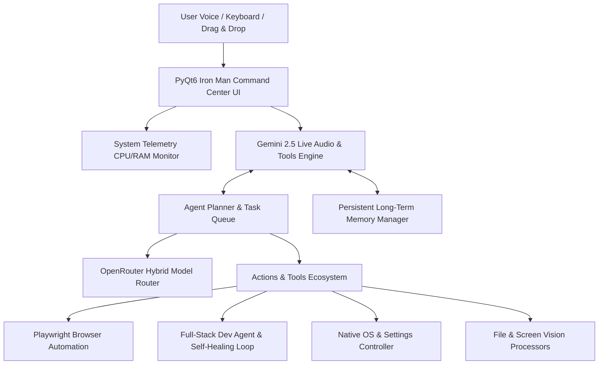

# 🤖 JARVIS

> **The Ultimate Cross-Platform Autonomous AI Desktop Assistant**  
> *Real-time Voice • Computer Vision • Full System Control • Autonomous Execution • Persistent Memory*

[](https://python.org)
[](https://www.qt.io/)
[](https://ai.google.dev/)
[](https://openrouter.ai/)

---

## 🌟 Overview

**JARVIS** is a next-generation, cross-platform personal AI assistant inspired by Iron Man's JARVIS. Operating seamlessly across **Windows**, **macOS**, and **Linux**, JARVIS combines ultra-low latency real-time voice streaming with vision awareness, operating system automation, full-stack software development, and autonomous multi-step task execution.

Unlike conventional chatbots, JARVIS sits directly on your system: it can hear your voice, see your active screen, inspect dropped files, control native applications, adjust OS settings, automate browsers via Playwright, build and debug entire software projects, and remember your personal preferences across sessions.

---

## 🔥 Feature Highlights

### 🎙️ Real-Time Bi-Directional Audio & Voice Interruption
- **Gemini 2.5 Flash Native Audio**: Real-time bi-directional audio streaming via WebSocket connection with 16kHz input / 24kHz output audio pipeline.
- **Instant Interruption (VAD)**: Speak at any moment to pause JARVIS mid-sentence and pivot conversation instantly.
- **Hybrid Input System**: Seamlessly switch between natural voice commands and keyboard text input.

### 👁️ Real-Time Screen & Vision Awareness
- **Desktop & Webcam Inspection**: Live screen capture using OpenCV, Pillow, and MSS for instant OCR, visual layout parsing, and image analysis.
- **Screen Debugging**: Ask JARVIS to inspect code errors, stack traces, design mockups, or videos currently active on your monitor.

### 💻 Full-Stack Dev Agent & Autonomous Self-Healing Engine
- **Autonomous Project Generator**: Automatically scaffolds complete projects under `~/Desktop/JarvisProjects`.
- **Multi-Attempt Self-Healing Debugger**: Executes terminal commands, captures tracebacks, identifies broken file lines, and attempts up to 5 self-correction loops until tests pass.
- **Code Assistant**: Smart code writing, refactoring, unit test generation, performance optimization, and syntax explaining.

### 🖥️ Native OS & Desktop Automation
- **Cross-Platform App Control**: Launch, minimize, maximize, resize, or terminate applications across Windows, macOS, and Linux.
- **System Settings Management**: Control system volume, mute states, display brightness, Wi-Fi status, Bluetooth, and battery power profiles.
- **Mouse & Keyboard Emulation**: Automated typing, clicking, hotkey combinations, and clipboard operations via PyAutoGUI.

### 🌐 Playwright Browser Automation & Web Research
- **Browser Automation**: Launch and control native browser channels (Chrome, Brave, Firefox, Edge, Opera, Vivaldi, Safari) with Playwright.
- **Web Navigation & Extraction**: Click elements, fill forms, execute searches, scroll pages, and scrape web content dynamically.
- **Specialized Web Tools**: Search Google Flights for travel deals, extract YouTube video transcripts, check weather reports, and run DuckDuckGo research queries.

### 🧠 Persistent Long-Term Memory
- **Automated Memory Extraction**: Automatically identifies personal facts, project details, and user preferences during interactions.
- **Context Injection**: Injects saved memories directly into system prompts for personalized long-term assistance.

### ⚡ OpenRouter Hybrid Model Routing
- **22+ Free-Tier LLM Fallbacks**: Intelligently routes high-frequency text actions, web search, and sub-agent planning through OpenRouter models (Nvidia Nemotron, Llama 3.3 70B, Qwen 3 Coder, Gemma 4, etc.).
- **Quota Optimization**: Preserves Gemini 2.5 Live rate limits while maintaining high performance for multi-step agent actions.

### 🎨 Iron Man Command Center GUI (PyQt6)
- **Cyber Navy & Glassmorphism Design**: High-tech UI featuring dark cyber navy gradients, glowing borders, and smooth animations.
- **Real-Time Audio Waveform**: Animated sinusoidal waveform visualizer indicating speech input and output.
- **Interactive File Drop Zone**: Drag-and-drop PDFs, scripts, source code, or images directly onto the UI.
- **Live System Telemetry**: Built-in CPU and RAM resource monitoring via `psutil`.

---

## 🧩 Action Modules & Capabilities Matrix

| Category | Action Module | Core Capabilities & Functions |
| :--- | :--- | :--- |
| **System** | `actions/open_app.py` | Launch applications, executables, system tools, or URLs across Windows, macOS, & Linux. |
| **System** | `actions/computer_control.py` | Mouse click/drag, keyboard typing, hotkey triggers, screenshot captures, clipboard actions. |
| **System** | `actions/computer_settings.py` | Adjust volume, toggle mute, change brightness, check battery, Wi-Fi & Bluetooth state. |
| **System** | `actions/desktop.py` | Active window tracking, focus management, window resizing, and workspace layout control. |
| **Browser** | `actions/browser_control.py` | Playwright browser automation, navigation, element clicking, text input, form submission. |
| **Browser** | `actions/web_search.py` | Live DuckDuckGo web search, page scraping, content extraction, item comparisons. |
| **Dev** | `actions/dev_agent.py` | Autonomous multi-file project creation, terminal command execution, 5-attempt fix loop. |
| **Dev** | `actions/code_helper.py` | AI code writer, editor, optimizer, debugger, build test executor, screen code analyzer. |
| **Files** | `actions/file_processor.py` | Deep file parsing (PDF, DOCX, TXT, MD, CSV, JSON), OCR, drop-zone file processing. |
| **Files** | `actions/file_controller.py` | File system manager: read, write, create, delete, move, copy, search, disk usage. |
| **Vision** | `actions/screen_processor.py` | Full-screen and target window visual capture, text OCR parsing, layout analysis. |
| **Tools** | `actions/youtube_video.py` | Search YouTube videos, playback control, transcript extraction (`youtube_transcript_api`). |
| **Tools** | `actions/flight_finder.py` | Automated flight deal finder and travel route comparison across airlines. |
| **Tools** | `actions/game_updater.py` | Steam / Epic / Riot game patch tracking, update scheduling, client management. |
| **Tools** | `actions/reminder.py` | System timers, local alerts, alarm notifications, scheduled reminders. |
| **Tools** | `actions/send_message.py` | Draft & send native notifications, email drafts, and chat messages. |
| **Tools** | `actions/weather_report.py` | Real-time weather reports and forecasts by location. |

---

## 🛠️ System Architecture



---

## 📂 Project Structure

```
.
├── main.py                    # Core entry point & Gemini Live audio event loop
├── ui.py                      # Iron Man Command Center PyQt6 interface & telemetry
├── or_client.py               # OpenRouter multi-model client with rate-limit fallbacks
├── setup.py                   # Automated dependency & Playwright browser installer
├── requirements.txt           # Python package requirements
├── config/
│   └── api_keys.json          # API keys for Gemini & OpenRouter
├── core/
│   └── prompt.txt             # System prompt & JARVIS persona definition
├── agent/
│   ├── planner.py             # Multi-step task planner & decomposition engine
│   ├── executor.py            # Tool execution supervisor
│   ├── task_queue.py          # Asynchronous task queue & worker thread
│   └── error_handler.py       # Self-healing loop & traceback line parser
├── memory/
│   ├── memory_manager.py      # Fact extraction & long-term memory storage
│   └── config_manager.py      # User settings & preferences persistence
└── actions/                   # Suite of 17 native OS, Web, Dev, and Vision tools
```

---

## 🚀 Quick Start Guide

### 1. Prerequisites
- **OS**: Windows 10/11, macOS 12+, or Linux (Ubuntu 20.04+)
- **Python**: `3.11` or `3.12`
- **Hardware**: Working Microphone & Speaker (for real-time voice interaction)
- **API Keys**:
  - [Google Gemini API Key](https://aistudio.google.com/) (*Required for voice & vision*)
  - [OpenRouter API Key](https://openrouter.ai/) (*Optional / Recommended for hybrid model routing*)

### 2. Installation

Clone the repository and run the setup script:

```bash
# Clone repository
git clone https://github.com/sujanyd/jarvis.git
cd jarvis

# Automated installation
python setup.py
```

*Or manually install dependencies:*

```bash
pip install -r requirements.txt
playwright install
```

### 3. API Key Configuration

Configure `config/api_keys.json`:

```json
{
  "gemini_api_key": "YOUR_GEMINI_API_KEY",
  "openrouter_api_key": "YOUR_OPENROUTER_API_KEY"
}
```

### 4. Launch JARVIS

Start the desktop assistant:

```bash
python main.py
```

---

## 🎮 Usage Tips

- 🎙️ **Voice Control**: Speak naturally into your microphone. Interrupt JARVIS at any time simply by speaking.
- 👁️ **Screen Inspection**: Ask *"What's on my screen right now?"* or *"Analyze this design/code on my display."*
- 📂 **File Drop Zone**: Drag PDFs, source code files, or images onto the PyQt6 window for instant analysis.
- 💻 **Build a Project**: Say *"Create a Python Flask web app with a dark mode UI on my desktop."*
- 🌐 **Browser Automation**: Say *"Find the top trending repositories on GitHub today"* or *"Search flights from NYC to Paris."*
- ⚙️ **OS Settings**: Say *"Set system volume to 80%"* or *"Mute audio."*
